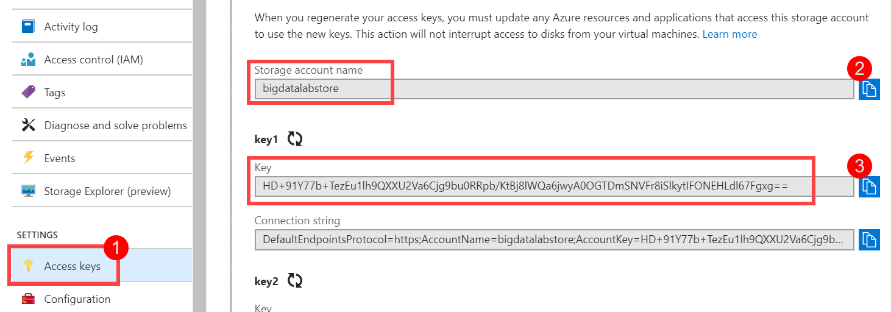
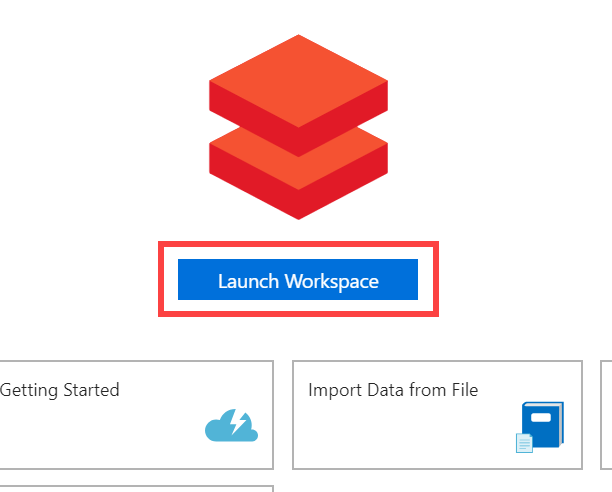

Big data and visualization

Hands-on lab step-by-step

November 2019

Information in this document, including URL and other Internet Web site references, is subject to change without notice. Unless otherwise noted, the example companies, organizations, products, domain names, e-mail addresses, logos, people, places, and events depicted herein are fictitious, and no association with any real company, organization, product, domain name, e-mail address, logo, person, place or event is intended or should be inferred. Complying with all applicable copyright laws is the responsibility of the user. Without limiting the rights under copyright, no part of this document may be reproduced, stored in or introduced into a retrieval system, or transmitted in any form or by any means (electronic, mechanical, photocopying, recording, or otherwise), or for any purpose, without the express written permission of Microsoft Corporation.

Microsoft may have patents, patent applications, trademarks, copyrights, or other intellectual property rights covering subject matter in this document. Except as expressly provided in any written license agreement from Microsoft, the furnishing of this document does not give you any license to these patents, trademarks, copyrights, or other intellectual property.

The names of manufacturers, products, or URLs are provided for informational purposes only and Microsoft makes no representations and warranties, either expressed, implied, or statutory, regarding these manufacturers or the use of the products with any Microsoft technologies. The inclusion of a manufacturer or product does not imply endorsement of Microsoft of the manufacturer or product. Links may be provided to third party sites. Such sites are not under the control of Microsoft and Microsoft is not responsible for the contents of any linked site or any link contained in a linked site, or any changes or updates to such sites. Microsoft is not responsible for webcasting or any other form of transmission received from any linked site. Microsoft is providing these links to you only as a convenience, and the inclusion of any link does not imply endorsement of Microsoft of the site or the products contained therein.

© 2019 Microsoft Corporation. All rights reserved.

Microsoft and the trademarks listed at https://www.microsoft.com/en-us/legal/intellectualproperty/Trademarks/Usage/General.aspx are trademarks of the Microsoft group of companies. All other trademarks are property of their respective owners.

**Contents**

<!-- TOC -->

- [Big data and visualization hands-on lab step-by-step](#big-data-and-visualization-hands-on-lab-step-by-step)
  - [Abstract and learning objectives](#abstract-and-learning-objectives)
  - [Overview](#overview)
  - [Solution architecture](#solution-architecture)
  - [Requirements](#requirements)
  - [Exercise 1: Get Storage Account Details]
      - [Task 1: Retrieve Azure Storage account information and Subscription Id](#task-1-retrieve-azure-storage-account-information-and-subscription-id)
  - [Exercise 2: Setup Azure Data Factory](#exercise-2-setup-azure-data-factory)
    
    - [Task 1: Configure Azure Data Factory](#task-1-configure-azure-data-factory)
    
  - [Exercise 3: Develop a data factory pipeline for data movement](#exercise-3-develop-a-data-factory-pipeline-for-data-movement)
    - [Task 1: Create copy pipeline using the Copy Data Wizard](#task-1-create-copy-pipeline-using-the-copy-data-wizard)
 
  - [Exercise 4: Retrieve lab environment information and create Databricks cluster](#exercise-4-retrieve-lab-environment-information-and-create-databricks-cluster)
    - [Task 1 : Create an Azure Databricks cluster](#task-1-create-an-azure-databricks-cluster)
  - [Exercise 2: Load Data and Databricks Notebooks](#exercise-2-load-sample-data-and-databricks-notebooks)
    
    - [Task 1: Open Azure Databricks and complete lab notebooks](#task-3-open-azure-databricks-and-complete-lab-notebooks)
  
    - [Task 2: Create Azure Databricks Linked Service](#task-1-create-azure-databricks-linked-service)
    - [Task 3: Trigger workflow](#task-2-trigger-workflow)
  - [Exercise 7: Visualizing in Power BI Desktop](#exercise-7-visualizing-in-power-bi-desktop)
    - [Task 1: Obtain the JDBC connection string to your Azure Databricks cluster](#task-1-obtain-the-jdbc-connection-string-to-your-azure-databricks-cluster)
    - [Task 2: Connect to Azure Databricks using Power BI Desktop](#task-2-connect-to-azure-databricks-using-power-bi-desktop)
    - [Task 3: Create Power BI report](#task-3-create-power-bi-report)
   - [After the hands-on lab](#after-the-hands-on-lab)
    - [Task 1: Delete resource group](#task-1-delete-resource-group)

<!-- /TOC -->

# Big data and visualization hands-on lab step-by-step

## Abstract and learning objectives

This hands-on lab is designed to provide exposure to many of Microsoft's transformative line of business applications built using Microsoft big data and advanced analytics.

By the end of the lab, you will be able to show an end-to-end solution, leveraging many of these technologies, but not necessarily doing work in every component possible.

## Solution architecture

Below is a diagram of the solution architecture you will build in this lab. Please study this carefully so you understand the whole of the solution as you are working on the various components.

## Requirements

1. Microsoft Azure subscription must be pay-as-you-go or MSDN.

   - Trial subscriptions will not work.

3. Follow all the steps provided in [Before the Hands-on Lab](Before%20the%20HOL%20-%20Big%20data%20and%20visualization.md).

## Exercise 1: Retrieve Azure Storage account information and Subscription Id

### Task 1: Retrieve Azure Storage account information and Subscription Id

You will need to have the Azure Storage account name and access key when you create your Azure Databricks cluster during the lab. You will also need to create storage containers in which you will store your data files.

1. From the side menu in the Azure portal, choose **Resource groups**, then enter your resource group name into the filter box, and select it from the list.

2. Next, select your lab Azure Storage account from the list.

   

3. On the Overview blade, locate and copy your Azure **Subscription Id** and save to a text editor such as Notepad for later.

   

4. Select **Access keys** (1) from the menu. Copy the **storage account name** (2) and the **key1** key (3) and copy the values to a text editor such as Notepad for later.

   

## Exercise 2: Create folders within DataLake Gen 2 

In the previous lab, you created a container called Analytics, we will add folders to store the raw data from Shopify and Magento.

You can use Azure Storage Explorer, navigate to the specific container, Analytics and create folders as follows:

  a.	raw/system/magento/

  b.	raw/system/shopify/

  c.	raw/system/postgress/

## Exercise 2: Setup Azure Data Factory

Duration: 20 minutes

In this exercise, you will create a baseline environment for Azure Data Factory development for further operationalization of data movement and processing. You will create a Data Factory service, create a Linked Service and set up copy from Magento and Shopify Data as the Source

### Task 1: Configure Azure Data Factory :Create copy pipeline using the Copy Data Wizard

1. Launch a new browser window, and navigate to the Azure portal (<https://portal.azure.com>). Once prompted, log in with your Microsoft Azure credentials. If prompted, choose whether your account is an organization account or a Microsoft account. This will be based on which account was used to provision your Azure subscription that is being used for this lab.

2. From the side menu in the Azure portal, choose **Resource groups**, then enter your resource group name into the filter box, and select it from the list.

3. Next, select your Azure Data Factory service from the list.

4. On the Data Factory blade, select **Author & Monitor** under Actions.

   

5. A new page will open in another tab or new window. Within the Azure Data Factory site, select **Author** (the pencil icon) on the menu.

   

6. Select the copy activity

   

7. In the Linked Service blade that appears select REST.

   

8. Fill in the details on the New Linked Service, you can refer to this link for details on each field:
https://docs.microsoft.com/en-us/azure/data-factory/connector-rest

   

9.Enter below details and Click Create

    a.	Give  name as ShopifyRest
  
    b.	Select Integration Run time as AutoResolveIntegrationRuntime
  
    c.	Base URL - <Base Shopify URL> similar to - https://<shop>.myshopify.com/admin/api/2020-01/
  
    d.	Authentication Type as Anonymous
  
 After specificying the above test the connection and click create the next screen required to enter the REST dataset properties.
  
10.	Specify REST dataset properties

    a.	Enter Relative URL as orders.json?limit=5&created_at_min=2020-02-13T00:00:00&created_at_max=2020-02-14T00:00:00&financial_status=any&status=any
  
    b.	Request Method – GET
  
    c.	Click New under Additional Headers
  
      i.	Name as Content-Type  , Value as application/json
    
      ii.	Name as X-Shopify-Access-Token , Value as <APIToken>
    
    d.	Click Next
  

   
11. On the Destination screen, select **+ Create new connection**.

12. Select **Azure Data Lake Gen 2** within the New Linked Service blade, then select **Continue**.

     
     
13. On the New Linked Service (Azure Data Lake Gen2) account screen, enter the following and then select **Create**.

    - Name: **DataLakeStorageOutput**

    - Connect via integration runtime: **Select your Integration Runtime**.

    - Authentication method: **Select Account key**.

    - Account selection method: **From Azure subscription**

    - Storage account name: **Select the data lake gen 2 storage account you provisioned in the before-the-lab section**.

14.	Choose the output file or folder , Browse -> analytics/raw/system/shopify and filename as orders.json
    
15. On the Destination data store page, select **Next**.

16.	File Format Settings, File Format as JSON, File pattern as Set of Objects

17.	Summary, Click Next

## Publish and monitor the ADF Pipeline

Click on Next and publish the pipeline.

## Monitor the pipeline

## Set up Magento as the Source

  Repeat the above process for Magento with 
  
    a.	Base URL as https://www.<shop>.com.sg/rest/
  
    b.	Relative URL as /V1/orders?searchCriteria[currentPage]=1&searchCriteria[pageSize]=500&searchCriteria[sortOrders][0][field]=entity_id&searchCriteria[sortOrders][0][direction]=ASC&searchCriteria[filter_groups][0][filters][0][field]=updated_at&searchCriteria[filter_groups][0][filters][0][value]=2020-01-31 00:00:00&searchCriteria[filter_groups][0][filters][0][condition_type]=gteq&searchCriteria[filter_groups][0][filters][1][field]=updated_at&searchCriteria[filter_groups][0][filters][1][value]=2020-02-06 00:00:00&searchCriteria[filter_groups][0][filters][1][condition_type]=lteq
    c.	Request Method – GET
    
    d.	Click New under Additional Headers
      i.	Name as Content-Type  , Value as application/json
      ii.	Name as Authorization, Value as Bearer <APIToken>
    e.	In Choose Output File or Folder -> select analytics/raw/system/magento/

## Parametrize the ADF Path

Parameterizing the URL and the output dataset location

1. Go to the Pipeline that got created. Click on Author icon to view the Pipelines

2.Click on the Pipeline that starts with CopyPipeline_

3.	Click on Copy data Activity on the right Pane and go to Source tab. Click on Open next to Source dataset

4.	It will open source dataset. Go to Parameters tab and add two new parameters

  updatedFromtimestamp = @substring(subtractFromTime(pipeline().TriggerTime,1,'hour'), 0, 19)
  updatedTotimestamp = @substring(pipeline().TriggerTime, 0, 19)
  
5. Go to Connections tab, in Relative URL click on Add dynamic content as 
  
  @concat('orders.json?        created_at_min=',dataset().updatedFromtimestamp,'&created_at_max=',dataset().updatedTotimestamp,'&financial_status=any&status=any')
  
  
  
 6. Click on CopyPipeline tab and there will be two parameters on the Source tab
 
  
  
 Provide the value as
updatedFromtimestamp = @substring(subtractFromTime(pipeline().TriggerTime,1,'hour'), 0, 19)
updatedTotimestamp = @substring(pipeline().TriggerTime, 0, 19)

7. Click on Validate All to save the changes

8. Next Go to Sink tab and Click on Open next to Sink dataset

9.	Go to Parameters tab and add following parameters

## Exercise 4: Retrieve lab environment information and create Databricks cluster

Duration: 10 minutes

In this exercise, you will retrieve your Azure Storage account name and access key and your Azure Subscription Id and record the values to use later within the lab. You will also create a new Azure Databricks cluster.

### Task 2: Create an Azure Databricks cluster

You have provisioned an Azure Databricks workspace, and now you need to create a new cluster within the workspace. Part of the cluster configuration includes setting up an account access key to your Azure Storage account, using the Spark Config within the new cluster form. This will allow your cluster to access the lab files.

1. From the side menu in the Azure portal, select **Resource groups**, then enter your resource group name into the filter box, and select it from the list.

2. Next, select your Azure Databricks service from the list.

   

3. In the Overview pane of the Azure Databricks service, select **Launch Workspace**.

   

   Azure Databricks will automatically log you in using Azure Active Directory Single Sign On.

   

4. Select **Clusters** (1) from the menu, then select **Create Cluster** (2).

   

5. On the Create New Cluster form, provide the following:

   - **Cluster Name**: lab

   - **Cluster Type**: Standard

   - **Databricks Runtime Version**: Runtime: 6.2 0r 6.3  (**Note**: the runtime version may have **LTS** after the version. This is also a valid selection.)

   - **Python Version**: 3

   - **Enable Autoscaling**: Uncheck this option.

   - **Auto Termination**: Check the box and enter 120

   - **Worker Type**: Standard_F4s

   - **Driver Type**: Same as worker

   - **Workers**: 1

      

6. Select **Create Cluster**.

## Exercise 2: Load Sample Data and Databricks Notebooks

In this exercise, you will load data from Data Lake Gen 2, perform transformations and write back to Data Lake Gen 2.

4. Open your Azure Databricks workspace. Before continuing to the next step, verify that your new cluster is running. Do this by navigating to **Clusters** on the left-hand menu and ensuring that the state of your cluster is **Running**.

   

### Task 1: Open Azure Databricks and complete lab notebooks

1. Download the following file:

   - [BigDataVis.dbc](lab-files/BigDataVis.dbc) <VIJI PLEASE PUT THE FILE PATH HERE FOR READING THE MAGENTO AND SHOPIFY DATA> 

2. Within Azure Databricks, select **Workspace** on the menu, then **Users**, select your user, then select the down arrow on the top of your user workspace. Select **Import**.

   

3. Within the Import Notebooks dialog, select Import from: file, then drag-and-drop the file or browse to upload it.

   

5. Before you begin, make sure you attach your cluster to the notebooks, using the dropdown. You will need to do this for each notebook you open. There are 5 notebooks included in the BigDataVis.dbc

   

6. Run each cell of the notebooks located in the **Exercise 2** folder (01, 02 and 03) individually by selecting within the cell, then entering **Ctrl+Enter** on your keyboard. Pay close attention to the instructions within the notebook so you understand each step of the data preparation process.

   

7. Do NOT run the `Clean up` part of Notebook 3 (i.e. this command: `webservice.delete()`). 

## Exercise 3: Operationalize Azure Databricks and Data Factory (Optional Task)

Duration: 20 minutes

In this exercise, you will extend the Data Factory to operationalize the Databricks Notebooks. 

### Task 1: Create Azure Databricks Linked Service

1. Return to, or reopen, the Author & Monitor page for your Azure Data Factory in a web browser, navigate to the Author view, and select the pipeline.

   

2. Once there, expand Databricks under Activities.

   

3. Drag the Notebook activity onto the design surface to the side of the Copy activity.

   

4. Select the Notebook activity on the design surface to display tabs containing its properties and settings at the bottom of the screen. On the **General** tab, enter "BatchScore" into the Name field.

   

5. Select the **Azure Databricks** tab, and select **+ New** next to the Databricks Linked service drop down. Here, you will configure a new linked service which will serve as the connection to your Databricks cluster.

   

6. On the New Linked Service dialog, enter the following:

   - Name: enter a name, such as **AzureDatabricks**.
   - Connect via integration runtime: Leave set to Default.
   - Account selection method: Select From Azure subscription.
   - Choose your Azure Subscription.
   - Pick your Databricks workspace to populate the Domain automatically.
   - Select cluster: choose **Existing interactive cluster**.

   

7. Leave the form open and open your Azure Databricks workspace in another browser tab. You will retrieve the Access token and cluster id here.

8. In Azure Databricks, select the Account icon in the top corner of the window, then select **User Settings**.

   

9. Select **Generate New Token** under the Access Tokens tab. Enter **ADF access** for the comment and leave the lifetime at 90 days. Select **Generate**.

   

10. **Copy** the generated token and **paste it into a text editor** such as Notepad for a later step.

    

11. Switch back to your Azure Data Factory screen and paste the generated token into the **Access token** field within the form. After a moment, select your cluster underneath **Choose from existing clusters**. Select **Create**.

    

12. Switch back to Azure Databricks. Select **Workspace** in the menu. Select the **Exercise 5** folder then open notebook **01 Deploy for Batch Scoring**. Examine the content but _don't run any of the cells yet_. You need to replace `STORAGE-ACCOUNT-NAME` with the name of the blob storage account you copied in Exercise 1.

    

13. Switch back to your Azure Data Factory screen. Select the **Settings** tab, then browse to your **Exercise 5/01 Deploy for Batch Score** notebook into the Notebook path field.

    

14. The final step is to connect the Copy activities with the Notebook activity. Select the small green box on the side of the copy activity, and drag the arrow onto the Notebook activity on the design surface. What this means is that the copy activity has to complete processing and generate its files in your storage account before the Notebook activity runs, ensuring the files required by the BatchScore notebook are in place at the time of execution. Select **Publish All** after making the connection.

    

### Task 2: Trigger workflow

1. Switch back to Azure Data Factory. Select your pipeline if it is not already opened.

2. Select **Trigger**, then **Trigger Now** located above the pipeline design surface.

   

3. Enter **3/1/2017** into the windowStart parameter, then select **Finish**.

   

4. Select **Monitor** in the menu. You will be able to see your pipeline activity in progress as well as the status of past runs.

   
   
   

## Exercise 4: Populating SnowFlakes using the Databricks connector for SnowFlakes

### Task 1: <VIJI>

## Exercise 5: Visualizing in Power BI Desktop

Duration: 20 minutes <VIJI>

In this exercise, you will create visualizations in Power BI Desktop.

### Task 1: Obtain the JDBC connection string to your Azure Databricks cluster - Optional

Before you begin, you must first obtain the JDBC connection string to your Azure Databricks cluster.

1. In Azure Databricks, go to Clusters and select your cluster.

2. On the cluster edit page, scroll down to the bottom of the page, expand **Advanced Options**, then select the **JDBC/ODBC** tab.

   

3. On the **JDBC/ODBC** tab, copy and save the first JDBC URL.

   - Construct the JDBC server address that you will use when you set up your Spark cluster connection in Power BI Desktop.

   - Take the JDBC URL that you copied and saved in step 3 and do the following:

   - Replace `jdbc:spark` with `https`.

   - Remove everything in the path between the port number and sql, retaining the components indicated by the boxes in the image below. Also remove `;AuthMech=3;UID=token;PWD=<personal-access-token>` from the end of the string.

   

   - In our example, the server address would be:

   <https://westus2.azuredatabricks.net:443/sql/protocolv1/o/2035768554230150/0603-160328-rage709> or <https://westus2.azuredatabricks.net:443/sql/protocolv1/o/2035768554230150/lab> (if you choose the aliased version)

### Task 2: Connect to Azure Databricks using Power BI Desktop [Optional]

1. If you did not already do so during the before the hands-on lab setup, download Power BI Desktop from https://powerbi.microsoft.com/en-us/desktop/.

2. When Power BI Desktop starts, you will need to enter your personal information, or Sign in if you already have an account.

   

3. Select Get data on the screen that is displayed next.
   

4. Select **Other** from the side, and select **Spark** from the list of available data sources.

   

5. Select **Connect**.

6. On the next screen, you will be prompted for your Spark cluster information.

7. Paste the JDBC connection string you constructed a few steps ago into the **Server** field.

8. Select the **HTTP** protocol.

9. Select **DirectQuery** for the Data Connectivity mode, and select **OK**. This option will offload query tasks to the Azure Databricks Spark cluster, providing near-real time querying.

   

10. Enter your credentials on the next screen as follows:

    - User name: **token**

    - Password: Remember that ADF Access token we generated and asked you to paste in Notepad, that is the password.

    

    

11. Select **Connect**.

12. In the Navigator dialog, check the box next to **flight_delays_summary**, and select **Load**.

    

13. It will take several minutes for the data to load into the Power BI Desktop client.

### Task 3: Create Power BI report

1. Once the data finishes loading, you will see the fields appear on the far side of the Power BI Desktop client window.

   

## After the hands-on lab

Duration: 10 minutes

In this exercise, attendees will deprovision any Azure resources that were created in support of the lab.

### Task 1: Delete resource group

1. Using the Azure portal, navigate to the Resource group you used throughout this hands-on lab by selecting **Resource groups** in the menu.

2. Search for the name of your research group and select it from the list.

3. Select **Delete** in the command bar and confirm the deletion by re-typing the Resource group name and selecting **Delete**.

You should follow all steps provided _after_ attending the Hands-on lab.
