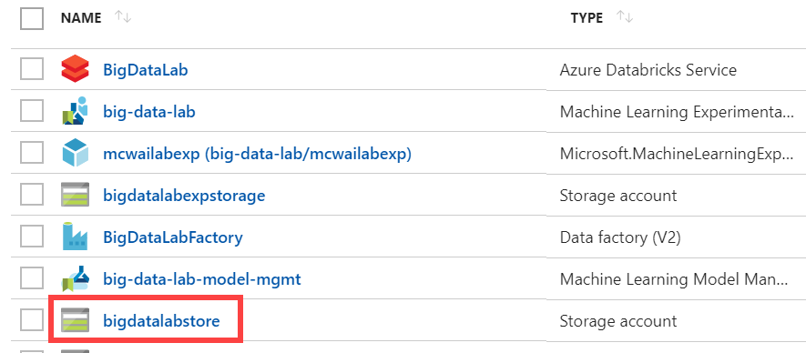
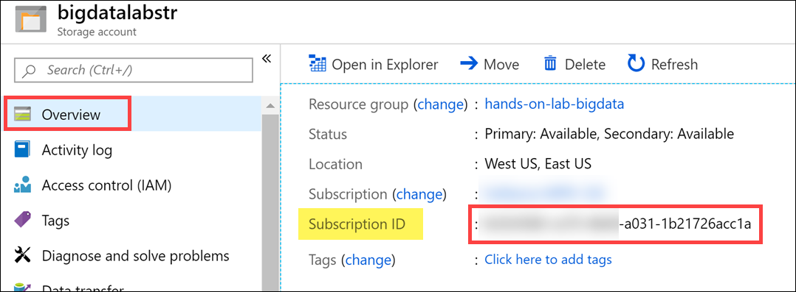

Big data and visualization

Hands-on lab step-by-step

November 2019

Information in this document, including URL and other Internet Web site references, is subject to change without notice. Unless otherwise noted, the example companies, organizations, products, domain names, e-mail addresses, logos, people, places, and events depicted herein are fictitious, and no association with any real company, organization, product, domain name, e-mail address, logo, person, place or event is intended or should be inferred. Complying with all applicable copyright laws is the responsibility of the user. Without limiting the rights under copyright, no part of this document may be reproduced, stored in or introduced into a retrieval system, or transmitted in any form or by any means (electronic, mechanical, photocopying, recording, or otherwise), or for any purpose, without the express written permission of Microsoft Corporation.

Microsoft may have patents, patent applications, trademarks, copyrights, or other intellectual property rights covering subject matter in this document. Except as expressly provided in any written license agreement from Microsoft, the furnishing of this document does not give you any license to these patents, trademarks, copyrights, or other intellectual property.

The names of manufacturers, products, or URLs are provided for informational purposes only and Microsoft makes no representations and warranties, either expressed, implied, or statutory, regarding these manufacturers or the use of the products with any Microsoft technologies. The inclusion of a manufacturer or product does not imply endorsement of Microsoft of the manufacturer or product. Links may be provided to third party sites. Such sites are not under the control of Microsoft and Microsoft is not responsible for the contents of any linked site or any link contained in a linked site, or any changes or updates to such sites. Microsoft is not responsible for webcasting or any other form of transmission received from any linked site. Microsoft is providing these links to you only as a convenience, and the inclusion of any link does not imply endorsement of Microsoft of the site or the products contained therein.

© 2019 Microsoft Corporation. All rights reserved.

Microsoft and the trademarks listed at https://www.microsoft.com/en-us/legal/intellectualproperty/Trademarks/Usage/General.aspx are trademarks of the Microsoft group of companies. All other trademarks are property of their respective owners.

**Contents**

<!-- TOC -->

- [Big data and visualization hands-on lab step-by-step](#big-data-and-visualization-hands-on-lab-step-by-step)
  - [Abstract and learning objectives](#abstract-and-learning-objectives)
  - [Overview](#overview)
  - [Solution architecture](#solution-architecture)
  - [Requirements](#requirements)
  -  [Exercise 1: Get Storage Account Details]
      - [Task 1: Retrieve Azure Storage account information and Subscription Id](#task-1-retrieve-azure-storage-account-information-and-subscription-id)
  - [Exercise 2: Setup Azure Data Factory](#exercise-2-setup-azure-data-factory)
    
    - [Task 1: Configure Azure Data Factory](#task-1-configure-azure-data-factory)
    
  - [Exercise 3: Develop a data factory pipeline for data movement](#exercise-3-develop-a-data-factory-pipeline-for-data-movement)
    - [Task 1: Create copy pipeline using the Copy Data Wizard](#task-1-create-copy-pipeline-using-the-copy-data-wizard)
 
  - [Exercise 4: Retrieve lab environment information and create Databricks cluster](#exercise-4-retrieve-lab-environment-information-and-create-databricks-cluster)
    - [Task 1 : Create an Azure Databricks cluster](#task-1-create-an-azure-databricks-cluster)
  - [Exercise 2: Load Data and Databricks Notebooks](#exercise-2-load-sample-data-and-databricks-notebooks)
    - [Task 1: Upload the Sample Datasets](#task-1-upload-the-sample-datasets)
    - [Task 3: Open Azure Databricks and complete lab notebooks](#task-3-open-azure-databricks-and-complete-lab-notebooks)
  
    - [Task 1: Create Azure Databricks Linked Service](#task-1-create-azure-databricks-linked-service)
    - [Task 2: Trigger workflow](#task-2-trigger-workflow)
  - [Exercise 6: Summarize data using Azure Databricks](#exercise-6-summarize-data-using-azure-databricks)
    - [Task: Summarize delays by airport](#task-summarize-delays-by-airport)
  - [Exercise 7: Visualizing in Power BI Desktop](#exercise-7-visualizing-in-power-bi-desktop)
    - [Task 1: Obtain the JDBC connection string to your Azure Databricks cluster](#task-1-obtain-the-jdbc-connection-string-to-your-azure-databricks-cluster)
    - [Task 2: Connect to Azure Databricks using Power BI Desktop](#task-2-connect-to-azure-databricks-using-power-bi-desktop)
    - [Task 3: Create Power BI report](#task-3-create-power-bi-report)
   - [After the hands-on lab](#after-the-hands-on-lab)
    - [Task 1: Delete resource group](#task-1-delete-resource-group)

<!-- /TOC -->

# Big data and visualization hands-on lab step-by-step

## Abstract and learning objectives

This hands-on lab is designed to provide exposure to many of Microsoft's transformative line of business applications built using Microsoft big data and advanced analytics.

By the end of the lab, you will be able to show an end-to-end solution, leveraging many of these technologies, but not necessarily doing work in every component possible.

## Solution architecture

Below is a diagram of the solution architecture you will build in this lab. Please study this carefully so you understand the whole of the solution as you are working on the various components.

## Requirements

1. Microsoft Azure subscription must be pay-as-you-go or MSDN.

   - Trial subscriptions will not work.

3. Follow all the steps provided in [Before the Hands-on Lab](Before%20the%20HOL%20-%20Big%20data%20and%20visualization.md).

## Exercise 1: Retrieve Azure Storage account information and Subscription Id

### Task 1: Retrieve Azure Storage account information and Subscription Id

You will need to have the Azure Storage account name and access key when you create your Azure Databricks cluster during the lab. You will also need to create storage containers in which you will store your data files.

1. From the side menu in the Azure portal, choose **Resource groups**, then enter your resource group name into the filter box, and select it from the list.

2. Next, select your lab Azure Storage account from the list.

   

3. On the Overview blade, locate and copy your Azure **Subscription Id** and save to a text editor such as Notepad for later.

   

4. Select **Access keys** (1) from the menu. Copy the **storage account name** (2) and the **key1** key (3) and copy the values to a text editor such as Notepad for later.

   

## Exercise 2: Setup Azure Data Factory

Duration: 20 minutes

In this exercise, you will create a baseline environment for Azure Data Factory development for further operationalization of data movement and processing. You will create a Data Factory service, create a Linked Service and set up copy a

### Task 1: Configure Azure Data Factory

1. Launch a new browser window, and navigate to the Azure portal (<https://portal.azure.com>). Once prompted, log in with your Microsoft Azure credentials. If prompted, choose whether your account is an organization account or a Microsoft account. This will be based on which account was used to provision your Azure subscription that is being used for this lab.

2. From the side menu in the Azure portal, choose **Resource groups**, then enter your resource group name into the filter box, and select it from the list.

3. Next, select your Azure Data Factory service from the list.

4. On the Data Factory blade, select **Author & Monitor** under Actions.

   

5. A new page will open in another tab or new window. Within the Azure Data Factory site, select **Author** (the pencil icon) on the menu.

   

6. Select the copy activity

   

7. In the Linked Service blade that appears select REST.

   

8. Fill in the details on the New Linked Service, you can refer to this link for details on each field:
https://docs.microsoft.com/en-us/azure/data-factory/connector-rest

   

9. Enter a **Name**, such as bigdatagateway-\[initials\], and select **Next**.

   

10. Under Option 2: Manual setup, copy the Key1 authentication key value by selecting the Copy button, then select **Finish**.

    

11. _Don't close the current screen or browser session_.

12. Paste the **Key1** value into the box in the middle of the Microsoft Integration Runtime Configuration Manager screen.

    

13. Select **Register**.

14. It will take a minute or two to register. If it takes more than a couple of minutes, and the screen does not respond or returns an error message, close the screen by selecting the **Cancel** button.

15. The next screen will be New Integration Runtime (Self-hosted) Node. Select Finish.

    

16. You will then get a screen with a confirmation message. Select the **Launch Configuration Manager** button to view the connection details.

    

    

17. You can now return to the Azure Data Factory page, and view the Integration Runtime you just configured.

    

18. Select the Azure Data Factory Overview button on the menu. Leave this open for the next exercise.

    

## Exercise 4: Develop a data factory pipeline for data movement

Duration: 20 minutes

In this exercise, you will create an Azure Data Factory pipeline to copy data using Magento and Shopify REST API to Azure Data Lake Gen 2. The goal of the exercise is to demonstrate data movement from REST API payload to Azure Storage (via the Integration Runtime).

### Task 1: Create copy pipeline using the Copy Data Wizard

1. Within the Azure Data Factory overview page, select **Copy Data**.

   

2. In the Copy Data properties, enter the following:

   - Task name: **CopyOnPrem2AzurePipeline**

   - Task description: (Optional) **"This pipeline copies timesliced CSV files from on-premises C:\\Data to Azure Blob Storage as a continuous job."**

   - Task cadence or Task schedule: **Select Run regularly on schedule**

   - Trigger type: **Select Schedule**

   - Start date time (UTC): **03/01/2018 12:00 am**

   - Recurrence: Select **Month(s)**, and enter Every **1**

   - Under the Advanced recurrence options, make sure you have a value of **0** in the textboxes for **Hours (UTC)** and **Minutes (UTC)**, otherwise it will fail later during Publishing.

   - End: **No End**

   

3. Select **Next**.

4. On the Source data store screen, select **+ Create new connection**.

5. Scroll through the options and select **File System**, then select **Continue**.

   

6. In the New Linked Service form, enter the following:

   - Name: **OnPremServer**

   - Connect via integration runtime: **Select the Integration runtime created previously in this exercise**.

   - Host: **C:\\Data**

   - User name: **Use your machine's login username**.

   - Password: **Use your machine's login password**.

7. Select **Test connection** to verify you correctly entered the values. Finally, select **Create**.

   

8. On the Source data store page, select **Next**.

   

11. Select **Next**.

12. On the Destination screen, select **+ Create new connection**.

13. Select **Azure Data Lake Gen 2** within the New Linked Service blade, then select **Continue**.

    
14. On the New Linked Service (Azure Data Lake Gen2) account screen, enter the following and then select **Create**.

    - Name: **DataLakeStorageOutput**

    - Connect via integration runtime: **Select your Integration Runtime**.

    - Authentication method: **Select Account key**.

    - Account selection method: **From Azure subscription**

    - Storage account name: **Select the data lake gen 2 storage account you provisioned in the before-the-lab section**.

    

15. On the Destination data store page, select **Next**.

16. From the **Choose the output file or folder** tab, enter the following:

    - Folder path: **sparkcontainer/FlightsAndWeather/{Year}/{Month}/**

    - Filename: **FlightsAndWeather.csv**

    - Year: Select **yyyy** from the drop down.

    - Month: Select **MM** from the drop down.

    - Copy behavior: **Merge files**

    - Select **Next**.

      

17. On the File format settings screen, select the **Text format** file format, and check the **Add header to file** checkbox, then select **Next**.

    

18. On the **Settings** screen, select **Skip incompatible rows** under Actions. Expand Advanced settings and set Degree of copy parallelism to **10**, then select **Next**.

    

19. Review settings on the **Summary** tab, but **DO NOT choose Next**.

    

20. Scroll down on the summary page until you see the **Copy Settings** section. Select **Edit** next to **Copy Settings**.

    

21. Change the following Copy settings:

    - Retry: Set to **3**.

    - Select **Save**.

      

22. After saving the Copy settings, select **Next** on the Summary tab.

23. On the **Deployment** screen you will see a message that the deployment in is progress, and after a minute or two that the deployment completed. Select **Edit Pipeline** to close out of the wizard.

    

## Exercise 1: Retrieve lab environment information and create Databricks cluster

Duration: 10 minutes

In this exercise, you will retrieve your Azure Storage account name and access key and your Azure Subscription Id and record the values to use later within the lab. You will also create a new Azure Databricks cluster.

### Task 2: Create an Azure Databricks cluster

You have provisioned an Azure Databricks workspace, and now you need to create a new cluster within the workspace. Part of the cluster configuration includes setting up an account access key to your Azure Storage account, using the Spark Config within the new cluster form. This will allow your cluster to access the lab files.

1. From the side menu in the Azure portal, select **Resource groups**, then enter your resource group name into the filter box, and select it from the list.

2. Next, select your Azure Databricks service from the list.

   

3. In the Overview pane of the Azure Databricks service, select **Launch Workspace**.

   

   Azure Databricks will automatically log you in using Azure Active Directory Single Sign On.

   

4. Select **Clusters** (1) from the menu, then select **Create Cluster** (2).

   

5. On the Create New Cluster form, provide the following:

   - **Cluster Name**: lab

   - **Cluster Type**: Standard

   - **Databricks Runtime Version**: Runtime: 5.5 (Scala 2.11, Spark 2.4.3) (**Note**: the runtime version may have **LTS** after the version. This is also a valid selection.)

   - **Python Version**: 3

   - **Enable Autoscaling**: Uncheck this option.

   - **Auto Termination**: Check the box and enter 120

   - **Worker Type**: Standard_F4s

   - **Driver Type**: Same as worker

   - **Workers**: 1

   - **Spark Config**: Edit the Spark Config by entering the connection information for your Azure Storage account that you copied above in Task 1. This will allow your cluster to access the lab files. Enter the following:

     `spark.hadoop.fs.azure.account.key.<STORAGE_ACCOUNT_NAME>.blob.core.windows.net <ACCESS_KEY>`, where <STORAGE_ACCOUNT_NAME> is your Azure Storage account name, and <ACCESS_KEY> is your storage access key.

   **Example:** `spark.hadoop.fs.azure.account.key.bigdatalabstore.blob.core.windows.net HD+91Y77b+TezEu1lh9QXXU2Va6Cjg9bu0RRpb/KtBj8lWQa6jwyA0OGTDmSNVFr8iSlkytIFONEHLdl67Fgxg==`

   

6. Select **Create Cluster**.

## Exercise 2: Load Sample Data and Databricks Notebooks

Duration: 60 minutes

In this exercise, you will load data from Data Lake Gen 2, perform transformations and write back to Data Lake Gen 2.

4. Open your Azure Databricks workspace. Before continuing to the next step, verify that your new cluster is running. Do this by navigating to **Clusters** on the left-hand menu and ensuring that the state of your cluster is **Running**.

   

5. Select **Data** from the menu. Next, select **default** under Databases (if this does not appear, start your cluster). Finally, select **Add Data** above the Tables header.

   

6. Select **Upload File** under Create New Table, and then select either select or drag-and-drop the FlightDelaysWithAirportCodes.csv file into the file area. Select **Create Table with UI**.

   

7. Select your cluster to preview the table, then select **Preview Table**.

### Task 3: Open Azure Databricks and complete lab notebooks

1. Download the following file:

   - [BigDataVis.dbc](lab-files/BigDataVis.dbc)

2. Within Azure Databricks, select **Workspace** on the menu, then **Users**, select your user, then select the down arrow on the top of your user workspace. Select **Import**.

   

3. Within the Import Notebooks dialog, select Import from: file, then drag-and-drop the file or browse to upload it.

   

4. After importing, expand the new **BigDataVis** folder.

5. Before you begin, make sure you attach your cluster to the notebooks, using the dropdown. You will need to do this for each notebook you open. There are 5 notebooks included in the BigDataVis.dbc

   

6. Run each cell of the notebooks located in the **Exercise 2** folder (01, 02 and 03) individually by selecting within the cell, then entering **Ctrl+Enter** on your keyboard. Pay close attention to the instructions within the notebook so you understand each step of the data preparation process.

   

7. Do NOT run the `Clean up` part of Notebook 3 (i.e. this command: `webservice.delete()`). You will need the URL of your Machine Learning Model exposed later in **Exercise 8: Deploy intelligent web app (Optional Lab)**. _Note: you could get this URL by updating your Notebook by adding this line `print(webservice.scoring_uri)` or by going to your Azure Machine Learning service workspace via the Azure portal and then to the "Deployments" blade._

8. Do NOT run any notebooks within the Exercise 5 or 6 folders. They will be discussed later in the lab.

## Exercise 5: Operationalize Azure Databricks and Data Factory

Duration: 20 minutes

In this exercise, you will extend the Data Factory to operationalize the scoring of data using the previously created machine learning model within an Azure Databricks notebook.

### Task 1: Create Azure Databricks Linked Service

1. Return to, or reopen, the Author & Monitor page for your Azure Data Factory in a web browser, navigate to the Author view, and select the pipeline.

   

2. Once there, expand Databricks under Activities.

   

3. Drag the Notebook activity onto the design surface to the side of the Copy activity.

   

4. Select the Notebook activity on the design surface to display tabs containing its properties and settings at the bottom of the screen. On the **General** tab, enter "BatchScore" into the Name field.

   

5. Select the **Azure Databricks** tab, and select **+ New** next to the Databricks Linked service drop down. Here, you will configure a new linked service which will serve as the connection to your Databricks cluster.

   

6. On the New Linked Service dialog, enter the following:

   - Name: enter a name, such as **AzureDatabricks**.
   - Connect via integration runtime: Leave set to Default.
   - Account selection method: Select From Azure subscription.
   - Choose your Azure Subscription.
   - Pick your Databricks workspace to populate the Domain automatically.
   - Select cluster: choose **Existing interactive cluster**.

   

7. Leave the form open and open your Azure Databricks workspace in another browser tab. You will retrieve the Access token and cluster id here.

8. In Azure Databricks, select the Account icon in the top corner of the window, then select **User Settings**.

   

9. Select **Generate New Token** under the Access Tokens tab. Enter **ADF access** for the comment and leave the lifetime at 90 days. Select **Generate**.

   

10. **Copy** the generated token and **paste it into a text editor** such as Notepad for a later step.

    

11. Switch back to your Azure Data Factory screen and paste the generated token into the **Access token** field within the form. After a moment, select your cluster underneath **Choose from existing clusters**. Select **Create**.

    

12. Switch back to Azure Databricks. Select **Workspace** in the menu. Select the **Exercise 5** folder then open notebook **01 Deploy for Batch Scoring**. Examine the content but _don't run any of the cells yet_. You need to replace `STORAGE-ACCOUNT-NAME` with the name of the blob storage account you copied in Exercise 1.

    

13. Switch back to your Azure Data Factory screen. Select the **Settings** tab, then browse to your **Exercise 5/01 Deploy for Batch Score** notebook into the Notebook path field.

    

14. The final step is to connect the Copy activities with the Notebook activity. Select the small green box on the side of the copy activity, and drag the arrow onto the Notebook activity on the design surface. What this means is that the copy activity has to complete processing and generate its files in your storage account before the Notebook activity runs, ensuring the files required by the BatchScore notebook are in place at the time of execution. Select **Publish All** after making the connection.

    

### Task 2: Trigger workflow

1. Switch back to Azure Data Factory. Select your pipeline if it is not already opened.

2. Select **Trigger**, then **Trigger Now** located above the pipeline design surface.

   

3. Enter **3/1/2017** into the windowStart parameter, then select **Finish**.

   

4. Select **Monitor** in the menu. You will be able to see your pipeline activity in progress as well as the status of past runs.

   

## Exercise 6: Summarize data using Azure Databricks

Duration: 20 minutes

In this exercise, you will prepare a summary of flight delay data using Spark SQL.

### Task: Summarize delays by airport

1. Open your Azure Databricks workspace, expand the **Exercise 6** folder and open the final notebook called **01 explore Data**.

   

2. Execute each cell and follow the instructions in the notebook that explains each step.

## Exercise 7: Visualizing in Power BI Desktop

Duration: 20 minutes

In this exercise, you will create visualizations in Power BI Desktop.

### Task 1: Obtain the JDBC connection string to your Azure Databricks cluster

Before you begin, you must first obtain the JDBC connection string to your Azure Databricks cluster.

1. In Azure Databricks, go to Clusters and select your cluster.

2. On the cluster edit page, scroll down to the bottom of the page, expand **Advanced Options**, then select the **JDBC/ODBC** tab.

   

3. On the **JDBC/ODBC** tab, copy and save the first JDBC URL.

   - Construct the JDBC server address that you will use when you set up your Spark cluster connection in Power BI Desktop.

   - Take the JDBC URL that you copied and saved in step 3 and do the following:

   - Replace `jdbc:spark` with `https`.

   - Remove everything in the path between the port number and sql, retaining the components indicated by the boxes in the image below. Also remove `;AuthMech=3;UID=token;PWD=<personal-access-token>` from the end of the string.

   

   - In our example, the server address would be:

   <https://westus2.azuredatabricks.net:443/sql/protocolv1/o/2035768554230150/0603-160328-rage709> or <https://westus2.azuredatabricks.net:443/sql/protocolv1/o/2035768554230150/lab> (if you choose the aliased version)

### Task 2: Connect to Azure Databricks using Power BI Desktop

1. If you did not already do so during the before the hands-on lab setup, download Power BI Desktop from https://powerbi.microsoft.com/en-us/desktop/.

2. When Power BI Desktop starts, you will need to enter your personal information, or Sign in if you already have an account.

   

3. Select Get data on the screen that is displayed next.
   

4. Select **Other** from the side, and select **Spark** from the list of available data sources.

   

5. Select **Connect**.

6. On the next screen, you will be prompted for your Spark cluster information.

7. Paste the JDBC connection string you constructed a few steps ago into the **Server** field.

8. Select the **HTTP** protocol.

9. Select **DirectQuery** for the Data Connectivity mode, and select **OK**. This option will offload query tasks to the Azure Databricks Spark cluster, providing near-real time querying.

   

10. Enter your credentials on the next screen as follows:

    - User name: **token**

    - Password: Remember that ADF Access token we generated and asked you to paste in Notepad, that is the password.

    

    

11. Select **Connect**.

12. In the Navigator dialog, check the box next to **flight_delays_summary**, and select **Load**.

    

13. It will take several minutes for the data to load into the Power BI Desktop client.

### Task 3: Create Power BI report

1. Once the data finishes loading, you will see the fields appear on the far side of the Power BI Desktop client window.

   

2. From the Visualizations area, next to Fields, select the Globe icon to add a Map visualization to the report design surface.

   

3. With the Map visualization still selected, drag the **OriginLatLong** field to the **Location** field under Visualizations. Then Next, drag the **NumDelays** field to the **Size** field under Visualizations.

   

4. You should now see a map that looks similar to the following (resize and zoom on your map if necessary):

   

5. Unselect the Map visualization by selecting the white space next to the map in the report area.

6. From the Visualizations area, select the **Stacked Column Chart** icon to add a bar chart visual to the report's design surface.

   

7. With the Stacked Column Chart still selected, drag the **DayofMonth** field and drop it into the **Axis** field located under Visualizations.

8. Next, drag the **NumDelays** field over, and drop it into the **Value** field.

   

9. Grab the corner of the new Stacked Column Chart visual on the report design surface, and drag it out to make it as wide as the bottom of your report design surface. It should look something like the following.

   

10. Unselect the Stacked Column Chart visual by selecting on the white space next to the map on the design surface.

11. From the Visualizations area, select the Treemap icon to add this visualization to the report.

    

12. With the Treemap visualization selected, drag the **OriginAirportCode** field into the **Group** field under Visualizations.

13. Next, drag the **NumDelays** field over, and drop it into the **Values** field.

    

14. Grab the corner of the Treemap visual on the report design surface, and expand it to fill the area between the map and the side edge of the design surface. The report should now look similar to the following.

    

15. You can cross filter any of the visualizations on the report by selecting one of the other visuals within the report, as shown below (This may take a few seconds to change, as the data is loaded).

    

16. You can save the report, by choosing Save from the File menu, and entering a name and location for the file.

    

## Exercise 8: Deploy intelligent web app (Optional Lab)

Duration: 20 minutes

In this exercise, you will deploy an intelligent web application to Azure from GitHub. This application leverages the operationalized machine learning model that was deployed in Exercise 1 to bring action-oriented insight to an already existing business process.

> **Please note:** If you are running your lab in a hosted Azure environment and you do not have permissions to create a new Azure resource group, the automated deployment task (#2 below) may fail, even if you choose an existing resource group. The automated deployment will also fail if the user you are logged into the portal with is **not** a Service Administrator or a Co-Administrator. If this happens, we recommend that you install [Visual Studio 2017/2019 Community](https://visualstudio.microsoft.com/downloads/) or greater, then use the [Publish feature](https://docs.microsoft.com/visualstudio/deployment/quickstart-deploy-to-azure?view=vs-2019) to publish to a new Azure web app. You will then need to create and populate two new Application Settings as outlined in the tasks that follow: `mlUrl` and `weatherApiKey`. **Skip ahead to Task 3 for further instructions.**

### Task 1: Register for a trial API account at darksky.net

To retrieve the 7-day hourly weather forecast, you will use an API from darksky.net. There is a free trial version that provides you access to the API you need for this hands-on lab.

1. Navigate to <https://darksky.net/dev>.

2. Select TRY FOR FREE.

   

3. Complete the Register form by providing your email address and a password. Select REGISTER.

   

4. Check your email account you used for registration. You should have a confirmation email from Dark Sky. Open the email and follow the confirmation link within to complete the registration process. When the welcome page loads, log in with your new account.

   

5. After logging in, you will be directed to the Your Account page. Take note of your **Secret Key** and copy it to a text editor such as Notepad for later. You will need this key to make API calls later in the lab.

   

6. To verify that your API Key is working, follow the link on the bottom of the page located underneath Sample API Call. You should see a JSON result that looks similar to the following:

   

### Task 2: Deploy web app from GitHub

1. Navigate to <https://github.com/Microsoft/MCW-Big-data-and-visualization/blob/master/Hands-on%20lab/lab-files/BigDataTravel/README.md> in your browser of choice, but where you are already authenticated to the Azure portal.

2. Read through the README information on the GitHub page.

3. Select **Deploy to Azure**.

   

4. On the following page, ensure the fields are populated correctly.

   - Ensure the correct Directory and Subscription are selected.

   - Select the Resource Group that you have been using throughout this lab.

   - Either keep the default Site name, or provide one that is globally unique, and then choose a Site Location.

   - Enter Weather API information.

   - Finally, enter the ML URL. We got this from Azure databricks Notebook #3 in the Exercise 2 folder. If you cleaned your resources at the end of this Notebook #3, you will need to re-run it and keep the web service running to get its associated URL.

   

   

5. Select **Next**, and on the following screen, select **Deploy**.

6. The page should begin deploying your application while showing you a status of what is currently happening.

   > **Note**: If you run into errors during the deployment that indicate a bad request or unauthorized, verify that the user you are logged into the portal with an account that is either a Service Administrator or a Co-Administrator. You won't have permissions to deploy the website otherwise.

7. After a short time, the deployment will complete, and you will be presented with a link to your newly deployed web application. CTRL+Click to open it in a new tab.

8. Try a few different combinations of origin, destination, date, and time in the application. The information you are shown is the result of both the ML API you published, as well as information retrieved from the DarkSky API.

9. Congratulations! You have built and deployed an intelligent system to Azure.

### Task 3: Manual deployment (optional)

**If the automated deployment from GitHub in the previous task failed**, follow these instructions to manually deploy.

1. Install [Visual Studio 2017/2019 Community](https://visualstudio.microsoft.com/downloads/) or greater. Make sure you select the **ASP.NET and web development** and **Azure development** workloads.

   

   > **Note**: If you are prompted to sign in to Visual Studio for the first time, enter the Azure account credentials you are using for this lab.

2. In a web browser, navigate to the [Big data and visualization MCW repo](https://github.com/microsoft/MCW-Big-data-and-visualization).

3. On the repo page, select **Clone or download**, then select **Download ZIP**.

   

4. Unzip the contents to your root hard drive (i.e. `C:\`). This will create a folder on your root drive named `C:\MCW-Big-data-and-visualization-master`.

5. Open Windows Explorer and navigate to `C:\MCW-Big-data-and-visualization-master\Hands-on lab\lab-files\BigDataTravel\`, then open **BigDataTravel.sln**.

6. In the Visual Studio Solution Explorer, right-click on the BigDataTravel project, then select **Publish...**.

   

7. In the Publish dialog, select the **App Service** publish target, select **Create New**, then choose **Publish**.

   

8. Enter the following into the App Service form that follows, then select **Create**:

   - **Name**: Enter a unique value.
   - **Subscription**: Choose the Azure subscription you are using for the lab.
   - **Resource group**: Select the Azure resource group you are using for the lab.
   - **Hosting Plan**: Select **New**, then create a new Hosting Plan in the same location and the **Free** size.
   - **Application Insights**: Select **None**.

   

9. After publishing is completed, open the new App Service located in your resource group in the [Azure portal](https://portal.azure.com).

10. Select **Configuration** in the left-hand menu.

    

11. Create the two following **Application settings**, then select **Save**:

    - **mlUrl**: Enter the Machine Learning URL. We got this from Azure databricks Notebook #3 in the Exercise 2 folder. If you cleaned your resources at the end of this Notebook #3, you will need to re-run it and keep the web service running to get its associated URL.
    - **weatherApiKey**: Enter the Dark Sky API key.

    

You will now be able to successfully navigate the web app.

## After the hands-on lab

Duration: 10 minutes

In this exercise, attendees will deprovision any Azure resources that were created in support of the lab.

### Task 1: Delete resource group

1. Using the Azure portal, navigate to the Resource group you used throughout this hands-on lab by selecting **Resource groups** in the menu.

2. Search for the name of your research group and select it from the list.

3. Select **Delete** in the command bar and confirm the deletion by re-typing the Resource group name and selecting **Delete**.

You should follow all steps provided _after_ attending the Hands-on lab.
